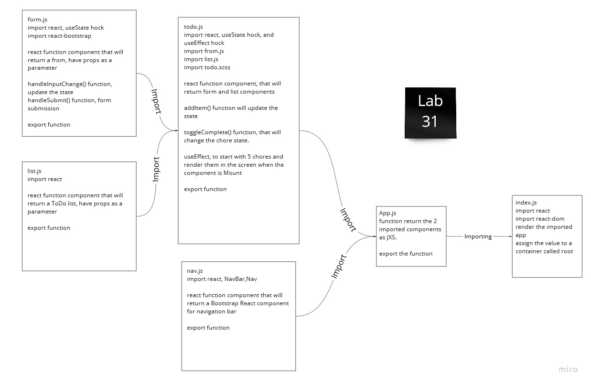

# ToDo App

This is a to Do application using React Hocks, SCSS , and React BootStrap components

### Start the app

This command will start the application in localhost:3000 mostly, you can see a deployed version of it in the link below.

```cmd
npm start
```

### Build the app

This command will convert your JXS,SCSS,and React component to JavaScript,HTML,and CSS files which the browser can read

```cmd
npm run build
```

### Deploy

# Phases

## Phase 1

- As a user, you have easy way to add a new to do item using an online interface
- As a user, your to do items will have an assignee, due date, difficulty meter, status and the task itself
- As a user, you can delete to do items that are no longer needed
- As a user, you can easily mark to do items as completed
- As a user, you can edit an existing to do item

### UML


